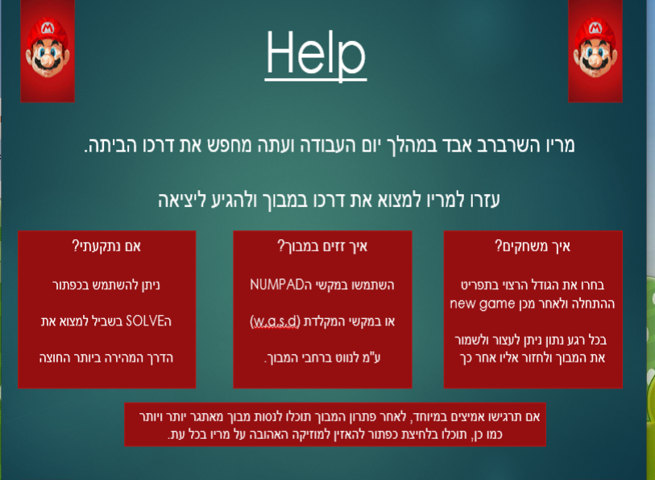

# MarioMaze

How to run the project:
1. download or clone the project.
2. using inteliji or any other java IDE open the downloaded folder from step one as a new project from exsisting source.
3.make sure the resource folder is regocnized as a resource folder and enjoy the game.

# Game Instructions

